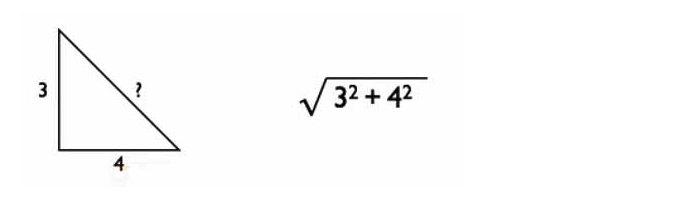

## TASK : Do Arithmetic Expression

#### 1.1

Write the expression that represents the arithmetic expression (7 - 2) \* 4 which equals 20.
Do not just write 20! Instead write expression that clearly mirrors (7 - 2) \* 4.

#### 1.2

Write two expressions that multiply the numbers 3, 5 and 7.
The first should take advantage of the fact that \* can accept more than 2 arguments.
The second should build up the result by first multiplying 3 times 5 and then multiply the result of that by 7.

#### 1.3 Pythagoras

